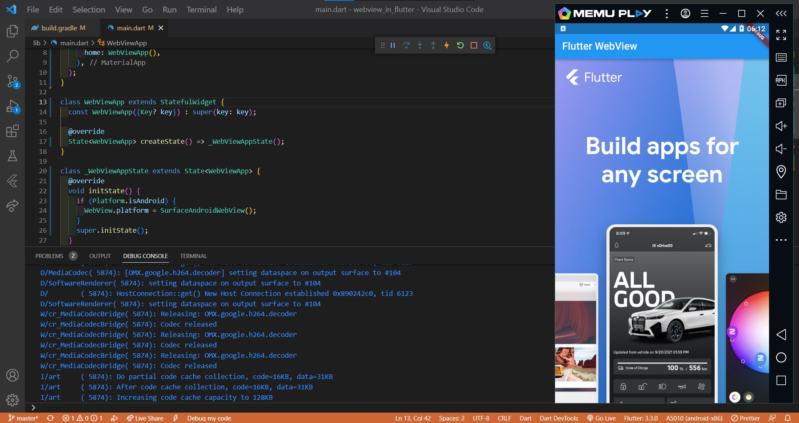
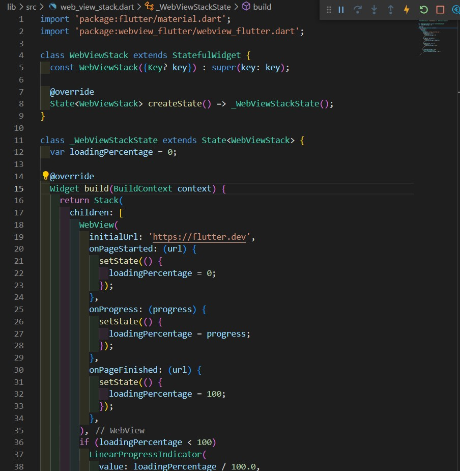
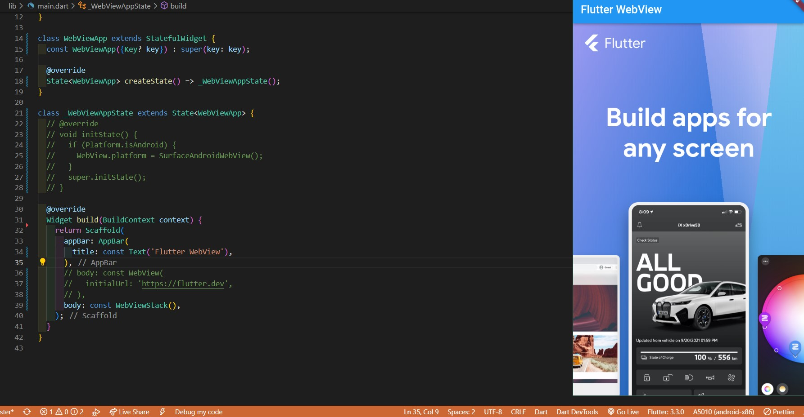

# webview_in_flutter

Menambahkan WebView ke aplikasi Flutter

### Menambahkan plugin WebView Flutter sebagai dependensi

`flutter pub add webview_flutter`

### Mengonfigurasi Android minSDK

Buka file `android/app/build.gradle` dan ubah `minSdkVersion` menjadi 19

### Hasil

### Memproses peristiwa pemuatan halaman

Ada tiga peristiwa pemuatan halaman berbeda yang diaktifkan: `onPageStarted`, `onProgress`, dan `onPageFinished`

#### Membuat file baru di `lib/src/web_view_stack.dart`

#### Hasil

### Menggunakan WebViewController
